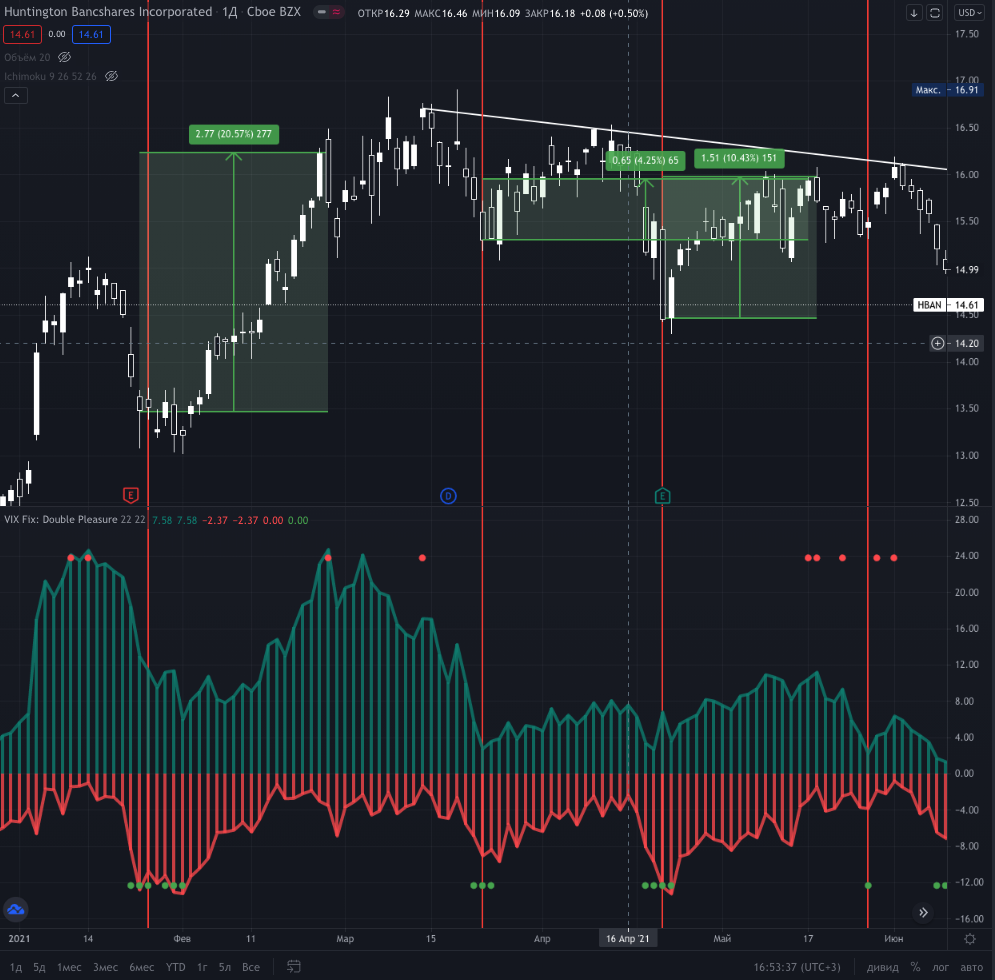
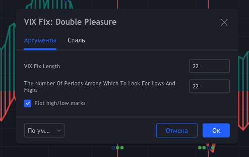

# VIX Fix Double Pleasure - TradingView PineScript

[Link to the script on TradingView](https://ru.tradingview.com/script/9zutsrOa-vix-fix-double-pleasure/)

The idea of an oscillator is quite simple. It is based on the popular VIX Fix oscillator, the purpose of which is to find local bottoms within the scope of trend movement. But in addition to the classic VIX fix, I built an oscillator opposite to it, which serves as a potential signal of the end of local growth.

## Components

* VIX Fix classic (red lines)
* VIX Fix reversed (green lines)
* Buy/sell signals (colored dots)

## Parameters

* **VIXFix_length** - defval: 22. Classic length for VIX fix
* **VIXFix_arraySize** - defval: 22. The number of periods among which to look for lows and highs. *If there are too many signals, reduce this value.*
* **plotMarks** - defval: true. Plot high/low marks

## How it is calculated

VIX fix classic: `(highest(close, VIXFix_length) - low) / highest(close, VIXFix_length) * -100`

VIX fix reversed: `(lowest(close, VIXFix_length) - high) / lowest(close, VIXFix_length) * -100`

## Signals

**🟢 Buy** signal if current "VIX fix classic" or "VIX Fix reversed" value is **lowest** from the last VIXFix_arraySize periods.

**🔴 Sell** signal if current "VIX fix classic" or "VIX Fix reversed" value is **highest** from the last VIXFix_arraySize periods.

## General recommendations

I advise you not to use this oscillator for a short positions. **Long only**. It is recommended to set a long position by pyramiding.

> **Warning: the oscillator is provided for educational purposes. Relying on an oscillator alone is very dangerous and unwise. All the actions you perform on your own risk.**
